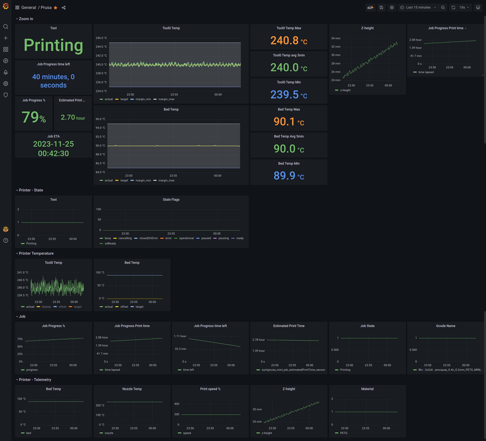
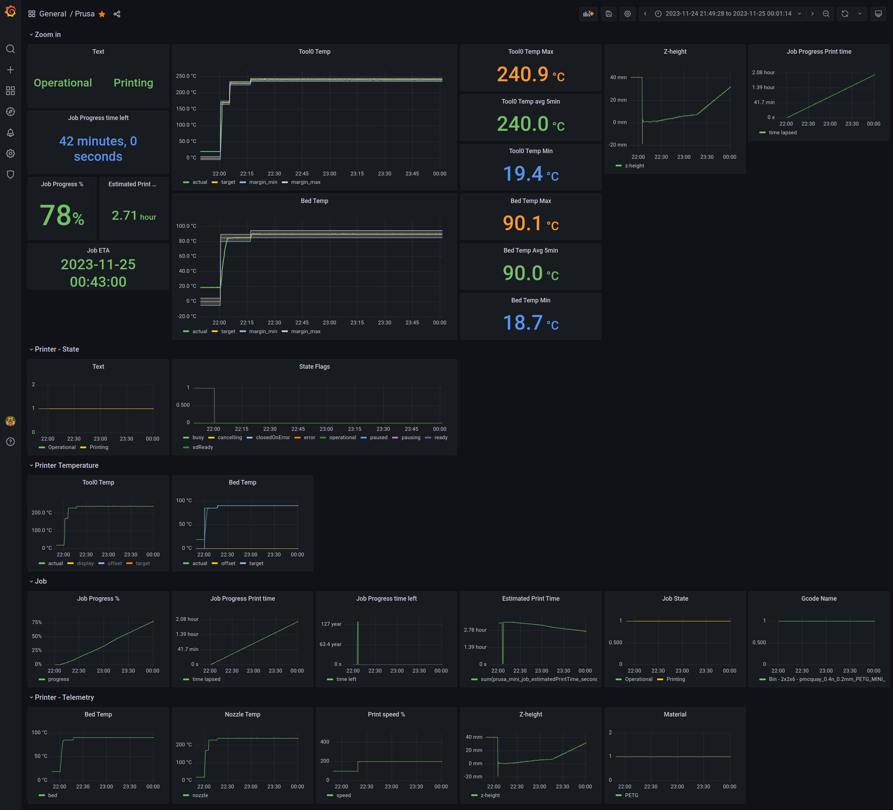

# About

Configuration to use [json-exporter](https://github.com/prometheus-community/json_exporter)
for Prometheus to scrape metrics from Prusa3D Mini/

Works with Prusa Mini+ firmware 4.4.1, but should be easy to adjust to other printers,
if they expose certain data over API in JSON format.





## Known limitations

- for now it supports only one printer instance (especially in dashboard),
  because I have only one printer. Feel free to create PR.

## Directories

- `k8s` helm values file to use, you need [prometheus-operator](https://github.com/prometheus-operator/prometheus-operator)
  to use ServiceMonitors.

- `grafana`, `json-exporter` and `prometheus` are used by docker-compose

- `prusa_api` - example json responses from the printer for easier writing code
  whithout the need of having working printer.

## Configuration

Below example assumes you use Prusa Mini with given firmware version.

- go to the Prusa LCD display menu
- Setting - Network - PrusaLink, write down Current API Key (`PRUSA_API_KEY`)
- ensure device got IP address (`PRUSA_MINI_HOST_ADDRESS`), write it down,
  will be needed later
- ensure that your 3D printer has static IP address in the network
- in all configs you can find in this repo replace `PRUSA_MINI_HOST_ADDRESS`
  with your printer address, so if your printer address is `192.168.0.20` then

  ```yaml
  ...
  targets:
  - name: prusa-mini-version
    url: http://PRUSA_MINI_HOST_ADDRESS:/api/version
  ```

  becomes

  ```yaml
  ...
  targets:
  - name: prusa-mini-version
    url: http://192.168.0.20:/api/version
  ```

- as above replace `PRUSA_API_KEY` with your printer key, such as if your api key is `DeadBEEf`

  ```yaml
        headers:
          X-Api-Key: PRUSA_API_KEY
  ```

  becomes

  ```yaml
        headers:
          X-Api-Key: DeadBEEf
  ```

## Test code

- turn on the 3D printer
- ensure configs are updated (printer IP and API key)
- run docker-compose up and go to [127.0.0.1:9009](http://127.0.0.1:9090)
- go and see if Status > Targets are green.
- go to [127.0.0.1:3000](http://127.0.0.1:3000) and use `admin:admin` to log in
- check dashboard
- copy dashboard, save as new, edit, export and add to `grafana/dashboards/`
- Grafana should reload dashboards automatically

## Known issues

### Grafana DS_PROMETHEUS not found

In dashboard in `templating` list, add example section as in [here](https://github.com/kubernetes/ingress-nginx/pull/4796/files)

### You committed secrets to the repo

I know.
